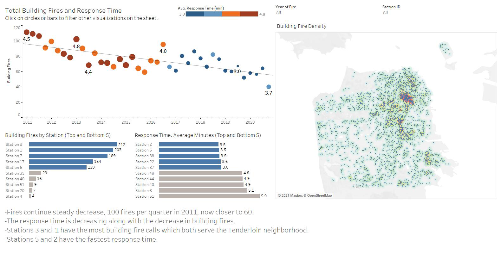

# Portfolio

#### Identifying Electric Vehicle Charging on Residential Power Grid
---
<kbd>

</kbd>

[Link to GitHub](https://github.com/OceanOdyssey/Default/blob/master/Identifying_EV_Charging_on_Residential_Power_Grid.ipynb)
-	Analyzed and visualized individual and aggregated customer consumption data to identify grid inefficiencies such as charging electric vehicles during periods of peak demand.  Goal of identifying and changing behavior.

#### NOAA Tidal Prediction Shift Based on Wind Speed and Direction
---
<kbd>

</kbd>

[Link to IBM Watson](https://dataplatform.cloud.ibm.com/analytics/notebooks/v2/9784097b-bd56-4948-b996-e6067ff7b866/view?access_token=e1701b9f5fbc71fef0da09e1600440fa8f50ae745022fa09a7af98a3dc12c96c)
- Assessed if wind direction and velocity caused a correlated shift to predicted tide levels in Wells, ME using Pandas and Jupyter Notebooks.
   - Extracted data using API and by segmenting requests to avoid limitations.
   - Plotted data with Seaborn and Matplotlib.
   - Determined ENE and E wind directions have a positive coorelation with respect to predicted height.  A 20 mph sustained wind will cause about a 2 ft increase in sea level.

#### San Francisco Fire Department Assessment
---

<kbd>

</kbd>

[Link to Tableu Public](https://public.tableau.com/profile/chrisg#!/vizhome/SanFranciscoFireDepartmentAssessment/SanFranciscoFireDepartmentAssessment)
- Evaluated the efficiency of the of each fire station in the San Francisco Fire Department.
- Created a visually compelling story by assessing response times of each station from original dataset of over 550k records.
