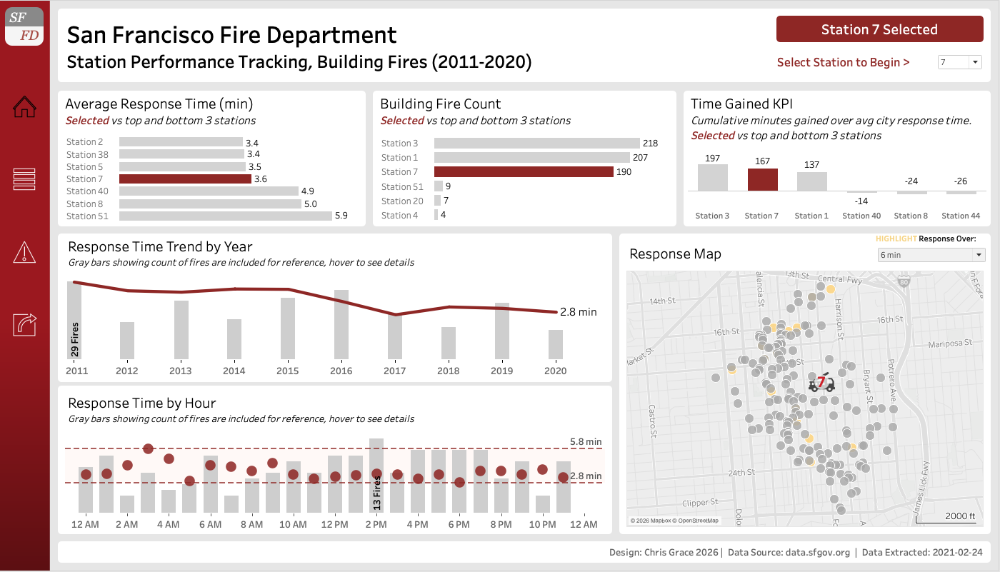
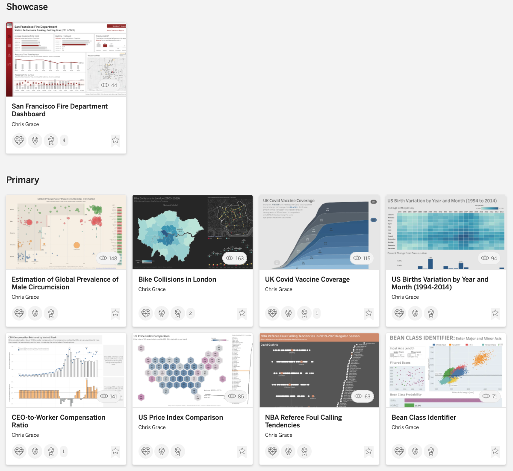
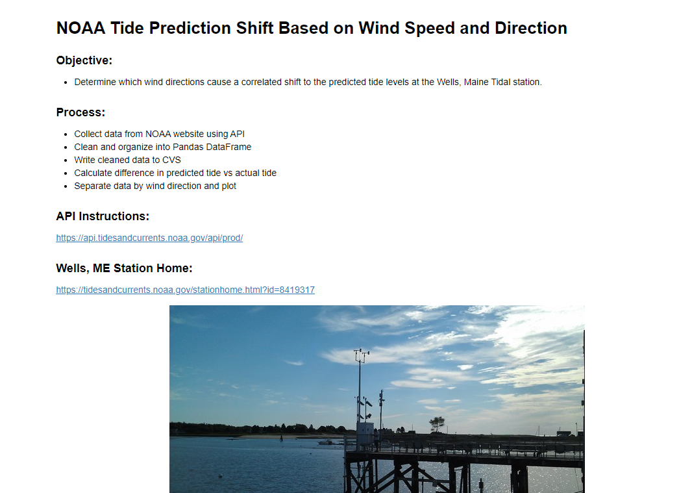
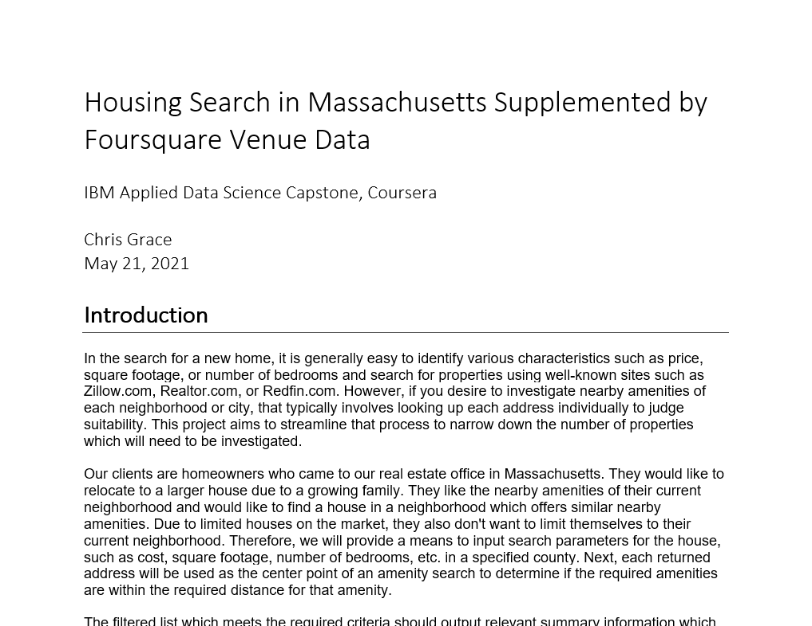

# Portfolio

---
#### San Francisco Fire Department Assessment

<kbd>

</kbd>

[Link to Dashboard on Tableau Public](https://public.tableau.com/app/profile/chrisg/viz/SanFranciscoFireDepartmentDashboard/SanFranciscoFireDepartmentDashboard-Revisited)  
[Link to Presentation on Tableau Public](https://public.tableau.com/profile/chrisg#!/vizhome/SanFranciscoFireDepartmentAssessment/SanFranciscoFireDepartmentAssessment)  
 
- Evaluated the efficiency of each fire station in the San Francisco Fire Department.
- Created a visually compelling Tableau story and dashboard by assessing response times of each station from original dataset of over 550k records.

---
#### Tableau Public

<kbd>

</kbd>

[Link to Tableau Public](https://public.tableau.com/profile/chrisg#!)  
- Participate in the Makeover Monday community project to create more effective visualizations using public data.
- Other projects of interest also captured.

---
#### NOAA Tidal Prediction Shift Based on Wind Speed and Direction

<kbd>

</kbd>

[Link to Jupyter Notebook in Jupyter NBViewer](https://nbviewer.org/github/christopher-grace/Default/blob/master/NOAA_Tide_Prediction_Shift.ipynb)
- Assessed if wind direction and velocity caused a correlated shift to predicted tide levels in Wells, ME using Pandas and Jupyter Notebook.
- Extracted data using API and by segmenting requests to avoid limitations.
- Plotted data with Seaborn and Matplotlib.
- Determined east-northeast and east wind directions have a positive correlation with respect to predicted height.  A 20 mph sustained wind from the ENE or E will cause about a 2 ft increase in sea level.

---
#### Housing Search in Massachusetts Supplemented by Foursquare Venue Data

<kbd>

</kbd>

[Link to PDF of Report](https://github.com/christopher-grace/Coursera_Capstone/blob/main/Presentations-Reports/Report%2C%20Housing%20Search%20in%20Massachusetts%20Supplemented%20by%20Foursquare%20Venue%20Data.pdf)  
[Link to Jupyter Notebook in Jupyter NBViewer](https://nbviewer.jupyter.org/github/christopher-grace/Coursera_Capstone/blob/79affdf05d02af84c4729b8e2b0e9890e37a53f1/Capstone_Course_Notebook-Cleaned%20Credentials.ipynb)  
- Leveraged Redfin and Foursquare APIs to create a method of recommending homes which fit both client house and neighborhood amenity criteria.
- Project returns a list of suitable homes as well as a Folium map of each suitable neighborhood with nearest required amenities shown.

---
